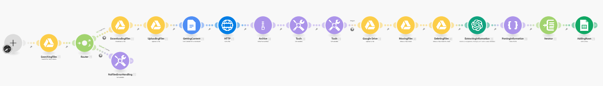

# 📄 Integration: Extract Images & Data from Google Drive PDFs to Google Sheets

## 📌 Summary
This Make scenario automates the extraction of property data and images from real estate PDF brochures stored in Google Drive. It converts the PDFs to Google Docs, extracts images, uses OpenAI GPT to parse text into structured JSON, and then logs the data into a Google Sheet. Processed files are organized into dedicated folders, making it ideal for streamlining real estate brochure analysis and reporting.

## 🚀 Features
- 🔍 Searches for new PDF files in a designated Google Drive folder.
- 📥 Downloads and converts the PDFs to Google Docs for easier parsing.
- 📸 Extracts embedded images and archives them as .zip.
- 🖼️ Filters and uploads high-resolution images to a dedicated Drive folder.
- 🤖 Uses OpenAI GPT to extract structured property data in JSON format.
- 📊 Parses and inserts this data into a Google Sheet report.
- 🗂️ Moves processed PDFs to a Processed folder and deletes temporary files.
- ⚠️ Handles errors when no files are found.
